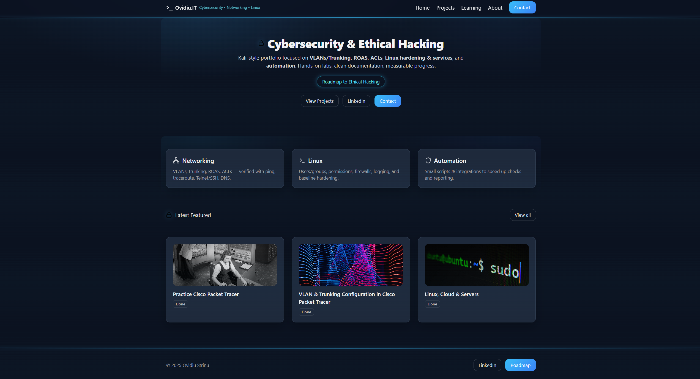

# Ovidiu.IT — Cybersecurity & Ethical Hacking Portfolio



A personal portfolio built with **Next.js 14 + Tailwind CSS**, inspired by the **Kali Linux aesthetic**.  
It showcases my journey into **Networking, Linux, and Ethical Hacking**, with live-synced projects from Notion.

---

## 🚀 Features

- **Next.js 14 (App Router)** — modern React framework with server components.
- **Tailwind CSS** — fully customized with gradients, glow, and terminal-inspired design.
- **Dynamic Projects** — fetched live from Notion DB (Featured + All Projects split).
- **Learning Hub** — roadmap-style view for Networking, Linux, Automation.
- **Responsive Design** — works on desktop, tablet, and mobile.
- **SEO Ready** — metadata, canonical, OpenGraph, Twitter cards.
- **Animated Accents** — cyan dividers flowing across navbar/footer, premium cyber vibe.

---

## 📂 Structure


app/
├─ layout.js # Root layout with navbar/footer
├─ page.js # Home (hero + roadmap pillars + latest featured)
├─ projects/ # Projects page, dynamic from Notion
├─ learning/ # Learning Hub (roadmap style)
├─ about/ # About page (bio, context, mission)
└─ contact/ # Contact page (email, LinkedIn, CTA)

lib/
└─ notion.js # Notion API helpers (projects DB)

components/
└─ ProjectCard.js # Project card UI with cover, tags, status


---

## 🛠️ Tech Stack

- **Framework:** Next.js 14 (App Router)
- **Styling:** Tailwind CSS (custom theme, gradients, animations)
- **Icons:** Lucide React
- **Database:** Notion API (Projects DB)
- **Hosting:** Vercel

---

## ⚡ Setup & Run Locally

1. **Clone the repo**
   ```bash
   git clone https://github.com/YOUR-USERNAME/ovidiu-it-site.git
   cd ovidiu-it-portfolio


Install dependencies

npm install


Set up environment variables
Create .env.local:

NOTION_API_KEY=secret_xxxxx
NOTION_DB_ID=xxxxxxxxxxxxxxxx


Run dev server

npm run dev


→ Open http://localhost:3000

🌐 Live Demo

Deployed on Vercel → https://ovidiu.it.com

📬 Contact

Email: digital@ovidiu.it

LinkedIn: Ovidiu Strinu

📌 Roadmap

 Projects auto-sync from Notion

 Learning Hub roadmap

 Premium UI polish (Kali Linux style)

 Blog module (future)

 Dark/light toggle

⭐ If you like this project, feel free to fork, star, and use it as inspiration.


---

